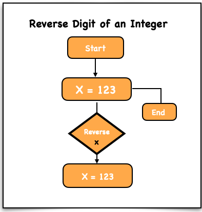

## Problem Statement
Write a function `reverse(x)` that takes a **32-bit signed integer** and returns its digits **reversed**.  
If the reversed value **overflows the 32-bit signed integer range**, return **0**.

## Requirements
- Reverse the digits of a **32-bit signed integer**.
- Return **0 if the result overflows**.

## Constraints

**Time Complexity:**  
O(d) — where **d** is the number of digits.

**Space Complexity:**  
O(1) — Constant space.

## Examples

**Input:**  
123  

**Output:**  
321

**Input:**  
-123  

**Output:**  
-321

**Input:**  
1534236469  

**Output:**  
0 (overflow)

## Approach
1. **Preserve the Original:** Save `x` in `xCopy`.
2. **Work with Absolute Value:** Use `Math.abs(x)` or `abs(x)` to simplify reversal.
3. **Reverse Digits:**
   - Initialize `rev = 0`.
   - While `x != 0`:
     - `last = x % 10`
     - `rev = rev * 10 + last`
     - `x //= 10`
4. **Check for Overflow:**  
   - Return `0` if the reversed number is outside the **32-bit integer range**.
5. **Restore Sign:**  
   - Return `-rev` if `xCopy < 0`, otherwise return `rev`.

## Visualisation
Visual representation of reversing digits



## Explanation
- Convert the number to **absolute value** to simplify the reversal process.
- Extract digits one by one using the **modulo operator (`%`)**.
- Build the reversed number by multiplying the current result by **10** and adding the last digit.
- Check if the reversed number exceeds the **32-bit integer limit**.
- Restore the **original sign** of the number before returning the result.

---

## JavaScript
```javascript
var reverse = function(x) {
  let xCopy = x;
  x = Math.abs(x);
  let rev = 0;

  while (x > 0) {
    let last = x % 10;
    rev = rev * 10 + last;
    x = Math.floor(x / 10);
  }

  if (rev > 2**31 - 1) return 0;

  return xCopy < 0 ? -rev : rev;
};

console.log(reverse(123)); // 321