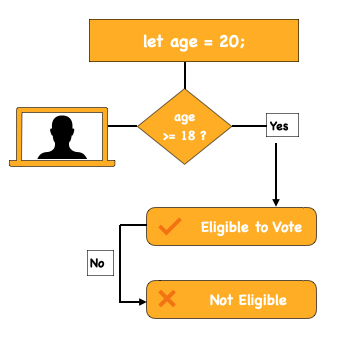

## Problem Statement
Write a program that accepts a number (age) and checks whether the person is eligible to vote. A person is eligible if their age is **18 or more**.

## Example

**Input:**  
20

**Process:**  
Check if 20 ≥ 18 → Eligible

**Output:**  
You are eligible to vote.

## Approach
1. Take input from the user (or define a variable).
2. Use a conditional statement to check if age is **18 or above**.
3. If yes, print **“You are eligible to vote.”**
4. Otherwise, print **“You are not eligible to vote.”**

## Visualisation
Voting eligibility diagram



## Explanation
- Accept **age** as input.  
- Use `if age >= 18` to check eligibility.  
- Show an appropriate message based on the condition.  
- The logic works the same across all programming languages.

---

## JavaScript
```javascript
let age = 20;

if (age >= 18) {
  console.log("You are eligible to vote.");
} else {
  console.log("You are not eligible to vote.");
}