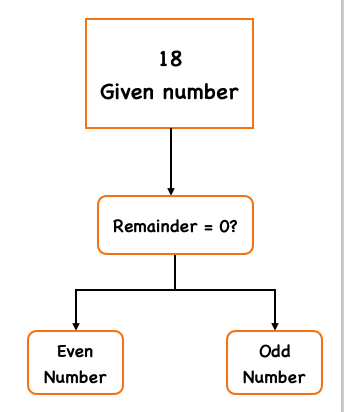

## Problem Statement
Write a function that accepts a number and checks whether it is **Even** or **Odd**.  
If the number is divisible by **2**, it’s an **Even number**. Otherwise, it’s an **Odd number**.  
Test the function with inputs **18** and **5**.

## Example

**Input:**  
18 → **Output:** Even Number  

**Input:**  
5 → **Output:** Odd Number

## Approach
1. Create a function that takes a number.
2. Check if `number % 2 === 0`.
3. If true, return **"Even"**.
4. Otherwise, return **"Odd"**.

## Visualisation
Even Odd Visual



## Explanation
- Accept the input number in the function.  
- Check if the number modulo **2** equals **0**.  
- If yes, print or return **“Even”**.  
- Otherwise, print or return **“Odd”**.  
- Test the function with different numbers to verify correctness.

---

## JavaScript
```javascript
function checkEvenOrOdd(number) {
  if (number % 2 === 0) {
    console.log("Even Number");
  } else {
    console.log("Odd Number");
  }
}

checkEvenOrOdd(18);
checkEvenOrOdd(5);