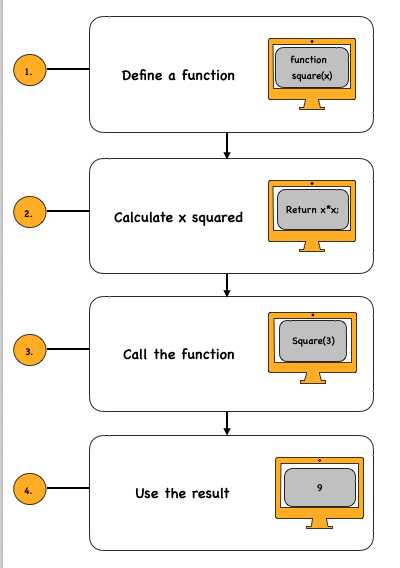

## Problem Statement
Write a function that takes an integer and returns its square. Call this function and print the result. `Square(x)` is a function that computes the square of a number. It returns the result instead of printing it.

## Example

**Input:**  
3

**Process:**  
square(3) = 3 × 3 = 9

**Output:**  
The square is: 9

## Approach
1. Define a function that takes one integer as input.
2. Compute the square of the number (multiply it by itself).
3. Return the result from the function.
4. Call the function and print the returned value.

## Visualisation
Visual explanation of square function



## Explanation
- `Square(x)` is a function that takes an integer as input.  
- It calculates the square using `x * x`.  
- Instead of printing the result inside the function, it returns the value.  
- The result is printed outside by calling the function.

---

## JavaScript
```javascript
function square(x) {
  return x * x;
}

let result = square(3);
console.log("The square is:", result);