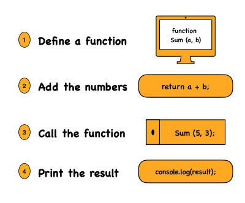

## Problem Statement
Write a program that defines a function to calculate the sum of two integers and prints the result. Call this function by passing two integer values.

## Approach
1. Define a function that takes two numbers as input.
2. Add the two numbers inside the function.
3. Call the function with two integers and print the result.

## Example

**Input:**  
5, 3

**Process:**  
a + b → 5 + 3 = 8

**Output:**  
8

## Visualisation
Visual representation of sum



## Explanation
- `Sum(a, b)` is a function that takes two arguments.  
- Adds them and stores the result in a variable named `add`.  
- Prints the result.  
- `Sum(5, 3)` calls the function with `a = 5` and `b = 3`, so it prints `8`.

---

## JavaScript
```javascript
function sum(a, b) {
  let add = a + b;
  console.log(add);
}

sum(5, 3);