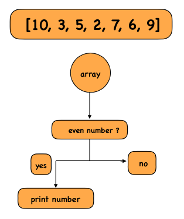

## Problem Statement
Write a program to print all **even numbers** from an array.

## Example

**Input:**  
[10, 3, 5, 2, 7, 6, 9]

**Output:**  
10 2 6

## Approach
1. Iterate through each element in the array.
2. Check if the element is divisible by **2**.
3. If yes, print the element (it’s even).

## Visualisation
Visual representation of even numbers in an array



## Explanation
- Create an array containing multiple numbers.
- Loop through each element of the array.
- Check whether the number is divisible by **2** using the modulo operator `%`.
- If the result is **0**, the number is even.
- Print all such even numbers.

---

## JavaScript
```javascript
let arr = [10, 3, 5, 2, 7, 6, 9];

for (let i = 0; i < arr.length; i++) {
  if (arr[i] % 2 === 0) {
    console.log(arr[i]);
  }
}