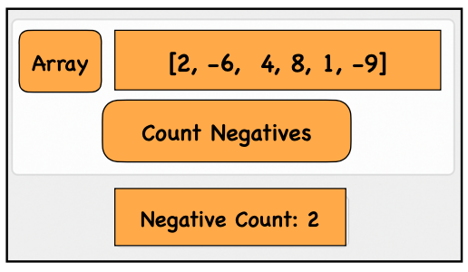

## Problem Statement
Write a function that returns the **number of negative numbers** in an array.

## Approach
1. Initialize a counter variable to **0**.
2. Loop through the array elements.
3. Check if the current element is **less than 0**.
4. If true, increment the counter.
5. After the loop ends, return the final count.

## Example

**Input:**  
arr = [2, -6, 4, 8, 1, -9]

**Output:**  
2

## Time & Space Complexity

**Time Complexity:**  
O(n) — where **n** is the number of elements in the array.

**Space Complexity:**  
O(1) — Only a counter variable is used.

## Visualisation
Visual representation of counting negative numbers in an array



## Explanation
- Create an array containing both positive and negative numbers.
- Traverse the array using a loop.
- For each element, check whether it is **less than 0**.
- If the condition is true, increase the counter.
- After checking all elements, return or print the total count of negative numbers.

---

## JavaScript
```javascript
function countNegativeNumbers(arr) {
  let count = 0;

  for (let i = 0; i < arr.length; i++) {
    if (arr[i] < 0) {
      count++;
    }
  }

  return count;
}

let arr = [2, -6, 4, 8, 1, -9];
let result = countNegativeNumbers(arr);

console.log("Result:", result); // Output: 2