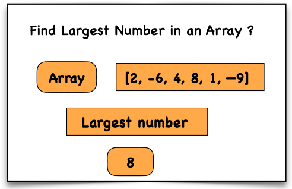

## Problem Statement
Write a function that returns the **largest number** in an array.

## Approach
1. Initialize a variable `largest` to **-Infinity**.
2. Loop through the array elements.
3. If the current element is **greater than `largest`**, update `largest`.
4. After the loop ends, return the value of `largest`.

## Example

**Input:**  
arr = [2, -6, 4, 8, 1, -9]

**Output:**  
8

## Time & Space Complexity

**Time Complexity:**  
O(n) – where **n** is the number of elements in the array.

**Space Complexity:**  
O(1) – Only a single variable is used.

## Visualisation
Visual representation of finding the largest element in an array



## Explanation
- Start by assuming the largest value is **-Infinity**.
- Traverse the array one element at a time.
- Compare each element with the current **largest** value.
- If a larger element is found, update the variable.
- After checking all elements, return the largest value.

---

## JavaScript
```javascript
function findLargest(arr) {
  let largest = -Infinity;

  for (let i = 0; i < arr.length; i++) {
    if (arr[i] > largest) {
      largest = arr[i];
    }
  }

  return largest;
}

let arr = [2, -6, 4, 8, 1, -9];
let result = findLargest(arr);

console.log("Result:", result); // Output: 8