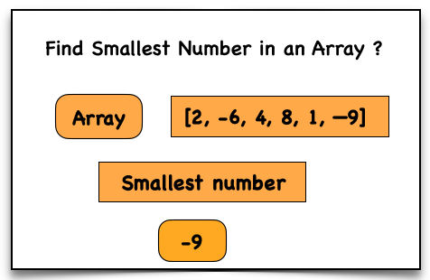

## Problem Statement
Write a function that returns the **smallest number** in an array.

## Approach
1. Initialize a variable `smallest` to **Infinity**.
2. Loop through the array elements.
3. If the current element is **less than `smallest`**, update `smallest`.
4. After the loop ends, return the value of `smallest`.

## Example

**Input:**  
arr = [2, -6, 4, 8, 1, -9]

**Output:**  
-9

## Time & Space Complexity

**Time Complexity:**  
O(n) – where **n** is the number of elements in the array.

**Space Complexity:**  
O(1) – Only a single variable is used.

## Visualisation
Visual representation of smallest element



## Explanation
- Start by assuming the smallest value is **Infinity**.
- Traverse the array one element at a time.
- Compare each element with the current **smallest** value.
- If a smaller element is found, update the variable.
- After checking all elements, return the smallest value.

---

## JavaScript
```javascript
function findSmallest(arr) {
  let smallest = Infinity;

  for (let i = 0; i < arr.length; i++) {
    if (arr[i] < smallest) {
      smallest = arr[i];
    }
  }

  return smallest;
}

let arr = [2, -6, 4, 8, 1, -9];
let result = findSmallest(arr);

console.log("Result:", result); // Output: -9