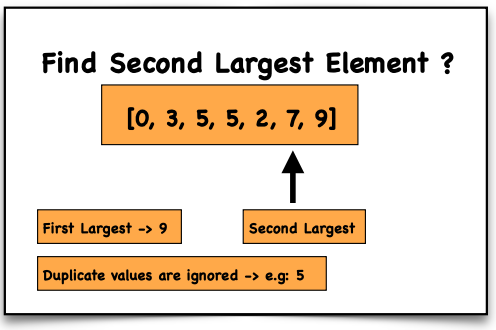

## Problem Statement
Write a function `secondLargest(arr)` that returns the **second largest distinct number** in an array.

## Requirements
- The array must contain **at least two elements**.
- If all elements are equal, return: **"No second largest found"**.
- If the array has fewer than two elements, return: **"Array should have at least two numbers"**.

## Examples

**Input:**  
arr = [0, 3, 5, 2, 7, 9]  
**Output:**  
7

**Input:**  
arr = [4, 4, 4, 4]  
**Output:**  
No second largest found

**Input:**  
arr = [5]  
**Output:**  
Array should have at least two numbers

**Input:**  
arr = [10, 20]  
**Output:**  
10

## Constraints

**Time Complexity:**  
O(n) — Single pass through the array.

**Space Complexity:**  
O(1) — Constant space.

## Approach
1. Check the array length. If fewer than **2 elements**, return the appropriate message.
2. Use two variables: `firstLargest` and `secondLargest`.
3. Traverse the array once.
4. Update `firstLargest` when a bigger element is found.
5. Update `secondLargest` when the element is smaller than `firstLargest` but greater than `secondLargest`.
6. Ignore duplicates by checking `num !== firstLargest`.

## Visualisation
Second Largest Visual



## Explanation
- Start with `firstLargest` and `secondLargest` initialized to **-Infinity**.
- Traverse the array once.
- Update the largest and second largest values accordingly.
- Ensure duplicates of the largest value are ignored.
- If `secondLargest` remains **-Infinity**, it means no second largest distinct number exists.

---

## JavaScript
```javascript
function secondLargest(arr) {
  if (arr.length < 2) return "Array should have at least two numbers";

  let first = -Infinity, second = -Infinity;

  for (let num of arr) {
    if (num > first) {
      second = first;
      first = num;
    } else if (num > second && num !== first) {
      second = num;
    }
  }

  return second === -Infinity ? "No second largest found" : second;
}

console.log(secondLargest([0, 3, 5, 2, 7, 9])); // 7