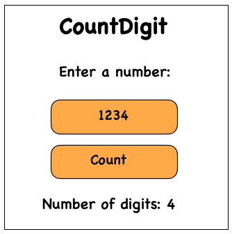

## Problem Statement
Write a function `countDigits(n)` that takes an integer **n** and returns how many **digits** it contains.

## Requirements
- Handles both **positive and negative integers**.
- Return **1 if n is 0** (since 0 is a single-digit number).

## Examples

**Input:**  
259  

**Output:**  
3

**Input:**  
-1035  

**Output:**  
4

**Input:**  
0  

**Output:**  
1

## Approach
1. **Handle Zero:** If `n == 0`, return **1** directly.
2. **Convert to Positive:** Use `abs(n)` to ignore the sign.
3. **Initialize a Counter:** Set `count = 0`.
4. **Loop:** While `n > 0`
   - Divide `n` by **10** using integer division.
   - Increment `count`.
5. **Return:** The value of `count` after the loop finishes.

## Visualisation
Visual representation of counting digits in a number



## Explanation
- If the number is **0**, return **1** because it has one digit.
- Convert negative numbers to positive using **absolute value**.
- Repeatedly divide the number by **10**.
- Each division removes the last digit.
- Count how many times this operation occurs.

---

## JavaScript
```javascript
function countDigits(n) {
  if (n === 0) return 1;

  n = Math.abs(n);
  let count = 0;

  while (n > 0) {
    n = Math.floor(n / 10);
    count++;
  }

  return count;
}

console.log(countDigits(259)); // 3