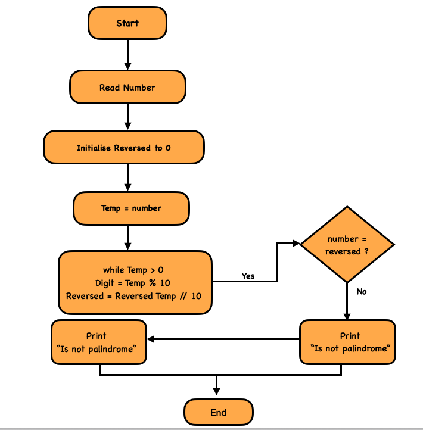

## Problem Statement
Write a function `isPalindrome(x)` that takes an integer **x** and returns **true** if it reads the same backward and forward; otherwise **false**.

## Requirements
- Handles both **positive and negative integers**.
- Return **false for negative numbers** (not Palindromes).

## Constraints

**Time Complexity:**  
O(d) — where **d** is the number of digits.

**Space Complexity:**  
O(1) — Only a few variables are used.

## Examples

**Input:**  
121  

**Output:**  
true

**Input:**  
-121  

**Output:**  
false

**Input:**  
10  

**Output:**  
false

## Approach
1. **Handle Negatives:** If `x < 0`, return **false**.
2. **Store Original:** Save the input in `xCopy` for later comparison.
3. **Reverse the Number:**
   - Initialize `rev = 0`.
   - While `x > 0`:
     - `rem = x % 10`
     - `rev = rev * 10 + rem`
     - `x = x // 10`
4. **Compare:**  
   - If `rev === xCopy`, return **true**.  
   - Otherwise, return **false**.

## Flow Chart
Visual representation of palindrome number checking



## Explanation
- Negative numbers are immediately rejected because they cannot read the same backward.
- The number is reversed digit by digit.
- The reversed number is compared with the original number.
- If both are equal, the number is a **Palindrome**.

---

## JavaScript
```javascript
var isPalindrome = function(x) {
  if (x < 0) return false;

  let xCopy = x;
  let rev = 0;

  while (x > 0) {
    let rem = x % 10;
    rev = rev * 10 + rem;
    x = Math.floor(x / 10);
  }

  return rev === xCopy;
};

console.log(isPalindrome(121)); // true