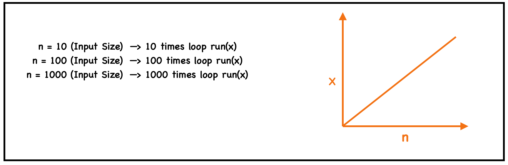
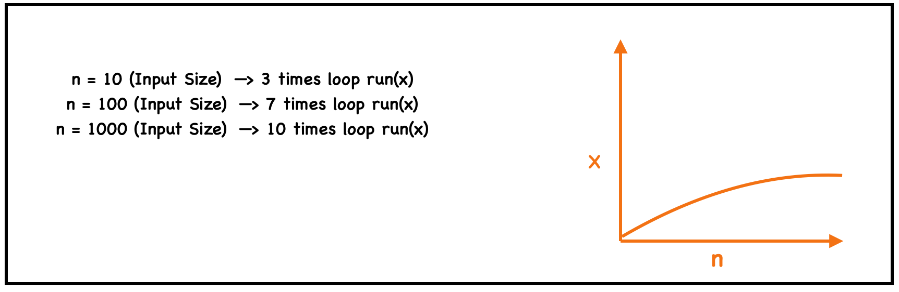

# Time Complexity and Space Complexity

## What is Time Complexity?

Time complexity measures how efficient an algorithm is as the input size increases.  
It describes how the number of operations grows when the input size **n** increases.

> **Time Complexity ≠ Execution Time**

Execution time depends on hardware, programming language, and compiler optimizations.  
Time complexity focuses only on how the **algorithm scales with input size**.

---

# Linear Search vs Binary Search

## Linear Search

- **Best Case:** Element at 1st index → **1 operation**
- **Average Case:** Element at n/2 index → **n/2 operations**
- **Worst Case:** Element not found → **n operations**

**Time Complexity:**  
`O(n)`

**Requirement:**  
Works on **unsorted arrays**

### Linear Search Graph



---

## Binary Search

- **Best Case:** Middle element matched → **1 operation**
- **Average Case:** **log₂(n)** operations
- **Worst Case:** **log₂(n)** operations

**Time Complexity:**  
`O(log n)`

**Requirement:**  
Works only on **sorted arrays**

### Binary Search Graph



---

### Efficiency Comparison

When we use **Linear Search** for an input size of **100**, it runs **100 times**.  
Whereas **Binary Search** takes only about **7 steps**.

This shows that **Binary Search is more efficient**.

As the input size **n increases**, the difference between algorithms becomes more significant.

---

# Big O Notation

Big O notation is a mathematical representation used to describe the **worst-case time complexity** of an algorithm.

It helps us understand how the **algorithm behaves as input size grows**.

---

# Code Examples of Time Complexity

## O(1) – Constant Time

```cpp
// Accessing the 5th index element
int value = arr[5];
```

The time complexity is **O(1)** because we directly access the element without any iteration.

---

## O(n) – Linear Time

```cpp
for(int i = 0; i < n; i++) {
    // do something
}
```

The loop runs **n times**, so the complexity is **O(n)**.

---

## O(log n) – Logarithmic Time

```cpp
// Binary Search
int binarySearch(int arr[], int n, int key) {

    int low = 0;
    int high = n - 1;

    while(low <= high) {

        int mid = (low + high) / 2;

        if(arr[mid] == key)
            return mid;

        else if(arr[mid] < key)
            low = mid + 1;

        else
            high = mid - 1;
    }

    return -1;
}
```

Binary search works by repeatedly **dividing the search space in half**.

---

## O(n²) – Nested Loops

```cpp
for(int i = 0; i < n; i++) {

    for(int j = 0; j < n; j++) {

        // do something

    }

}
```

Two loops running **n times** each results in **n × n = n² operations**.

---

## O(n log n)

```cpp
for(int i = 0; i < n; i++) {

    int temp = n;

    while(temp > 1) {

        temp = temp / 2;

        // do something

    }

}
```

This type of complexity appears in algorithms like:

- Merge Sort
- Heap Sort
- Quick Sort (average case)

---

## O(n³) – Triple Nested Loops

```cpp
for(int i = 0; i < n; i++) {

    for(int j = 0; j < n; j++) {

        for(int k = 0; k < n; k++) {

            // do something

        }

    }

}
```

Three loops produce **n × n × n = n³ operations**.

---

## O(2ⁿ) – Exponential Complexity

```cpp
// Recursive Fibonacci
int fib(int n) {

    if(n <= 1)
        return n;

    return fib(n-1) + fib(n-2);
}
```

Each recursive call creates **two additional recursive calls**.

---

## O(n!) – Factorial Complexity

```cpp
// Permutation generator
void permute(string s, int l, int r) {

    if(l == r) {

        cout << s << endl;

    }
    else {

        for(int i = l; i <= r; i++) {

            swap(s[l], s[i]);

            permute(s, l + 1, r);

            swap(s[l], s[i]); // backtrack

        }

    }
}
```

Factorial complexity grows **extremely fast**.

---

# Time Complexity Priority (Best → Worst)

| Complexity | Example |
|---|---|
| **O(1)** | Constant time |
| **O(log n)** | Binary Search |
| **O(n)** | Linear Search |
| **O(n log n)** | Merge Sort |
| **O(n²)** | Nested loops |
| **O(n³)** | Triple loops |
| **O(2ⁿ)** | Fibonacci recursion |
| **O(n!)** | Permutations |


---

# What is Space Complexity?

Space complexity refers to how much **extra memory an algorithm requires** during execution.

It includes:

- Variables
- Data structures
- Recursion stack

---

## Space Complexity Examples

| Operation | Space Complexity |
|---|---|
| Access 5th element | O(1) |
| Find maximum with variable | O(1) |
| Create new array | O(n) |
| 2D Matrix | O(n²) |

---

# Summary

- **Time Complexity** measures how an algorithm scales with input size.
- **Space Complexity** measures how much memory an algorithm uses.
- **Big O notation** represents the worst-case scenario.
- Efficient algorithms aim for **O(log n)** or **O(n)** complexity rather than **O(n²)** or worse.