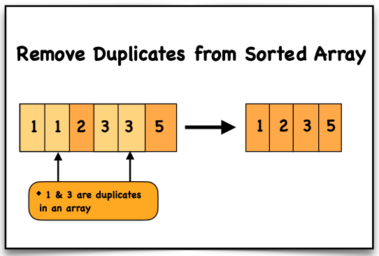

# Remove Duplicates from Sorted Array

## Problem Statement

Given an integer array `nums` sorted in **non-decreasing order**, remove the duplicates **in-place** such that each unique element appears **only once**.

The **relative order of elements must remain the same**.

Return the number of **unique elements** in the array.

Let the number of unique elements be **k**.

To get accepted:

- The first **k elements** of `nums` must contain the unique elements.
- The remaining elements of `nums` are not important.
- Return **k**.

---

# Examples

## Example 1

**Input**

```
nums = [1,1,2]
```

**Output**

```
2, nums = [1,2,_]
```

**Explanation**

Your function should return **k = 2**.

The first two elements should be:

```
[1,2]
```

Anything beyond index `k` does not matter.

---

## Example 2

**Input**

```
nums = [0,0,1,1,1,2,2,3,3,4]
```

**Output**

```
5, nums = [0,1,2,3,4,_,_,_,_,_]
```

**Explanation**

Your function should return **k = 5**.

The first five elements should be:

```
[0,1,2,3,4]
```

The remaining elements are ignored.

---

# Constraints

```
1 ≤ nums.length ≤ 3 * 10^4
-100 ≤ nums[i] ≤ 100
nums is sorted in non-decreasing order
```

---

# Important Points

## Non-decreasing Order

The array is sorted such that values either **stay the same or increase**.

```
nums[i] <= nums[i+1]
```

### Examples

Valid:

```
[1,1,2,3,3,5]
```

Invalid:

```
[3,2,1]
```

This is **decreasing order**.

---

## In-place Modification

You must modify the **original array `nums`**.

You **cannot create another array**.

---

# Approach

1. Initialize a pointer `x = 0` to track the last unique element.
2. Traverse the array using a loop.
3. If `nums[i] > nums[x]`:
   - Increment `x`
   - Set `nums[x] = nums[i]`
4. This shifts unique elements forward.
5. After the loop finishes, the number of unique elements is:

```
x + 1
```

---

# Time Complexity

The algorithm runs a **single loop** through the array.

Each step performs constant operations.

```
Time Complexity = O(n)
```

Where **n = nums.length**

---

# Space Complexity

The array is modified **in-place**.

Only two extra variables are used:

- `x`
- `i`

```
Space Complexity = O(1)
```

---

# Dry Run

### Input

```
[1, 1, 2, 3, 3, 5]
```

### Initial State

```
x = 0
```

### Iteration Steps

```
i = 0 → nums[i] = 1, nums[x] = 1 → NOT greater → skip

i = 1 → nums[i] = 1, nums[x] = 1 → NOT greater → skip

i = 2 → nums[i] = 2, nums[x] = 1 → GREATER
        x = 1
        nums[1] = 2

i = 3 → nums[i] = 3, nums[x] = 2 → GREATER
        x = 2
        nums[2] = 3

i = 4 → nums[i] = 3, nums[x] = 3 → NOT greater → skip

i = 5 → nums[i] = 5, nums[x] = 3 → GREATER
        x = 3
        nums[3] = 5
```

### Final Array

```
[1, 2, 3, 5, 3, 5]
```

### Unique Count

```
x + 1 = 4
```

### Output

```
4
```

First **4 elements are unique**

```
[1,2,3,5]
```

---

# Visualization



---

# Code Implementations

## JavaScript

```javascript
var removeDuplicates = function(nums) {

    let x = 0;

    for (let i = 0; i < nums.length; i++) {

        if (nums[i] > nums[x]) {

            x++;

            nums[x] = nums[i];

        }

    }

    return x + 1;

};
```

---

## Python

```python id="python-remove-duplicates"
def removeDuplicates(nums):

    x = 0

    for i in range(len(nums)):

        if nums[i] > nums[x]:

            x += 1
            nums[x] = nums[i]

    return x + 1
```

---

## Java

```java id="java-remove-duplicates"
class Solution {

    public int removeDuplicates(int[] nums) {

        int x = 0;

        for(int i = 0; i < nums.length; i++) {

            if(nums[i] > nums[x]) {

                x++;
                nums[x] = nums[i];

            }

        }

        return x + 1;

    }
}
```

---

## C++

```cpp id="cpp-remove-duplicates"
class Solution {

public:

    int removeDuplicates(vector<int>& nums) {

        int x = 0;

        for(int i = 0; i < nums.size(); i++) {

            if(nums[i] > nums[x]) {

                x++;
                nums[x] = nums[i];

            }

        }

        return x + 1;

    }

};
```

---

## C

```c id="c-remove-duplicates"
int removeDuplicates(int* nums, int numsSize) {

    int x = 0;

    for(int i = 0; i < numsSize; i++) {

        if(nums[i] > nums[x]) {

            x++;
            nums[x] = nums[i];

        }

    }

    return x + 1;

}
```

---

## C#

```csharp id="cs-remove-duplicates"
public class Solution {

    public int RemoveDuplicates(int[] nums) {

        int x = 0;

        for(int i = 0; i < nums.Length; i++) {

            if(nums[i] > nums[x]) {

                x++;
                nums[x] = nums[i];

            }

        }

        return x + 1;

    }

}
```

---

# Summary

- Uses **two-pointer technique**
- Removes duplicates **in-place**
- Maintains **sorted order**
- Efficient solution with:

```
Time Complexity: O(n)
Space Complexity: O(1)
```