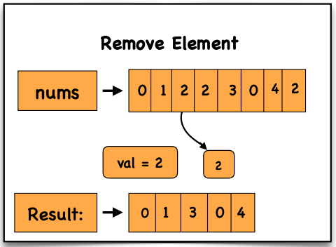

# Remove Element from Array

## Problem Statement

Given an integer array `nums` and an integer `val`, remove all occurrences of `val` **in-place**.

The order of elements **may change**.

Return the number of elements in `nums` that are **not equal to `val`**.

Let this count be **k**.

To get accepted:

- Modify `nums` such that the first **k elements** contain values **not equal to `val`**
- Remaining elements beyond `k` do not matter
- Return **k**

---

# Examples

## Example 1

**Input**

```
nums = [3,2,2,3], val = 3
```

**Output**

```
2, nums = [2,2,_,_]
```

**Explanation**

First **2 elements** should be:

```
[2,2]
```

---

## Example 2

**Input**

```
nums = [0,1,2,2,3,0,4,2], val = 2
```

**Output**

```
5, nums = [0,1,4,0,3,_,_,_]
```

**Explanation**

First **5 elements** can be any order of:

```
[0,1,4,0,3]
```

---

# Approach

1. Initialize a pointer `x = 0`
2. Traverse the array using index `i`
3. If `nums[i] != val`:
   - Assign `nums[x] = nums[i]`
   - Increment `x`
4. After traversal, `x` represents the count of valid elements

---

# Time Complexity

The algorithm iterates through the array once:

```
Time Complexity = O(n)
```

---

# Space Complexity

The array is modified **in-place** and uses only a few variables:

```
Space Complexity = O(1)
```

---

# Dry Run

### Input

```
nums = [0, 1, 2, 2, 3, 0, 4, 2]
val = 2
```

### Initial State

```
x = 0
```

### Iteration Steps

```
i = 0 → nums[0] = 0 ≠ 2 → nums[0] = 0, x = 1

i = 1 → nums[1] = 1 ≠ 2 → nums[1] = 1, x = 2

i = 2 → nums[2] = 2 = 2 → skip

i = 3 → nums[3] = 2 = 2 → skip

i = 4 → nums[4] = 3 ≠ 2 → nums[2] = 3, x = 3

i = 5 → nums[5] = 0 ≠ 2 → nums[3] = 0, x = 4

i = 6 → nums[6] = 4 ≠ 2 → nums[4] = 4, x = 5

i = 7 → nums[7] = 2 = 2 → skip
```

### Final Result

```
k = 5
nums = [0, 1, 3, 0, 4]
```

---

# Visualization



---

# Code Implementations

## JavaScript

```javascript
var removeElement = function(nums, val) {

  let x = 0;

  for (let i = 0; i < nums.length; i++) {

    if (nums[i] != val) {

      nums[x] = nums[i];
      x++;

    }

  }

  return x;
};
```

---

## Python

```python id="python-remove-element"
def removeElement(nums, val):

    x = 0

    for i in range(len(nums)):

        if nums[i] != val:

            nums[x] = nums[i]
            x += 1

    return x
```

---

## Java

```java id="java-remove-element"
class Solution {

    public int removeElement(int[] nums, int val) {

        int x = 0;

        for(int i = 0; i < nums.length; i++) {

            if(nums[i] != val) {

                nums[x] = nums[i];
                x++;

            }

        }

        return x;
    }
}
```

---

## C++

```cpp id="cpp-remove-element"
class Solution {

public:

    int removeElement(vector<int>& nums, int val) {

        int x = 0;

        for(int i = 0; i < nums.size(); i++) {

            if(nums[i] != val) {

                nums[x] = nums[i];
                x++;

            }

        }

        return x;
    }

};
```

---

## C

```c id="c-remove-element"
int removeElement(int* nums, int numsSize, int val) {

    int x = 0;

    for(int i = 0; i < numsSize; i++) {

        if(nums[i] != val) {

            nums[x] = nums[i];
            x++;

        }

    }

    return x;
}
```

---

## C#

```csharp id="cs-remove-element"
public class Solution {

    public int RemoveElement(int[] nums, int val) {

        int x = 0;

        for(int i = 0; i < nums.Length; i++) {

            if(nums[i] != val) {

                nums[x] = nums[i];
                x++;

            }

        }

        return x;
    }
}
```

---

# Summary

- Uses **two-pointer technique**
- Removes elements **in-place**
- Order of elements **may change**
- Efficient solution:

```
Time Complexity: O(n)
Space Complexity: O(1)
```