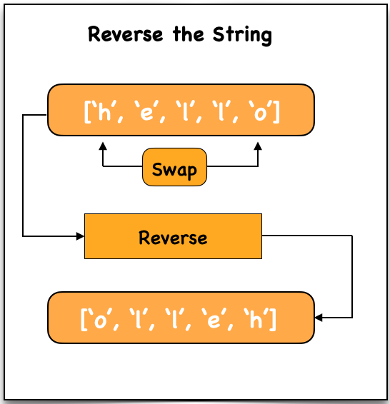

# Reverse String (In-place)

## Problem Statement

Write a function that reverses a string.

The input string is given as an array of characters `s`.

You must modify the array **in-place** using **O(1) extra memory**.

---

# Examples

## Example 1

**Input**

```
s = ["h","e","l","l","o"]
```

**Output**

```
["o","l","l","e","h"]
```

---

## Example 2

**Input**

```
s = ["H","a","n","n","a","h"]
```

**Output**

```
["h","a","n","n","a","H"]
```

---

# Approach (Two Pointer Technique)

1. Initialize two pointers:
   - One at the **start**
   - One at the **end**
2. Swap the characters at both pointers
3. Move pointers toward the center
4. Stop when they meet

---

# Time Complexity

```
O(n)
```

---

# Space Complexity

```
O(1)
```

---

# Dry Run

### Input

```
s = ["h", "e", "l", "l", "o"]
```

### Initial State

```
len = 5
halfLen = 2
```

### Iteration Steps

```
i = 0 → swap s[0] and s[4]
        ["o", "e", "l", "l", "h"]

i = 1 → swap s[1] and s[3]
        ["o", "l", "l", "e", "h"]
```

### Output

```
["o", "l", "l", "e", "h"]
```

---

# Visualisation



---

# Code Implementations

## JavaScript

```javascript
var reverseString = function(s) {

    let len = s.length;
    let halfLen = Math.floor(len / 2);

    for (let i = 0; i < halfLen; i++) {

        let temp = s[i];
        s[i] = s[len - i - 1];
        s[len - i - 1] = temp;

    }
};
```

---

## Python

```python id="python-reverse-string"
def reverseString(s):

    left = 0
    right = len(s) - 1

    while left < right:

        s[left], s[right] = s[right], s[left]

        left += 1
        right -= 1
```

---

## Java

```java id="java-reverse-string"
class Solution {

    public void reverseString(char[] s) {

        int left = 0;
        int right = s.length - 1;

        while(left < right) {

            char temp = s[left];
            s[left] = s[right];
            s[right] = temp;

            left++;
            right--;
        }
    }
}
```

---

## C++

```cpp id="cpp-reverse-string"
class Solution {

public:

    void reverseString(vector<char>& s) {

        int left = 0;
        int right = s.size() - 1;

        while(left < right) {

            swap(s[left], s[right]);

            left++;
            right--;
        }
    }

};
```

---

## C

```c id="c-reverse-string"
void reverseString(char* s, int len) {

    int left = 0;
    int right = len - 1;

    while(left < right) {

        char temp = s[left];
        s[left] = s[right];
        s[right] = temp;

        left++;
        right--;
    }
}
```

---

## C#

```csharp id="cs-reverse-string"
public class Solution {

    public void ReverseString(char[] s) {

        int left = 0;
        int right = s.Length - 1;

        while(left < right) {

            char temp = s[left];
            s[left] = s[right];
            s[right] = temp;

            left++;
            right--;
        }
    }
}
```

---

# Summary

- Uses **Two Pointer Technique**
- Works **in-place (no extra memory)**
- Efficient solution:

```
Time Complexity: O(n)
Space Complexity: O(1)
```