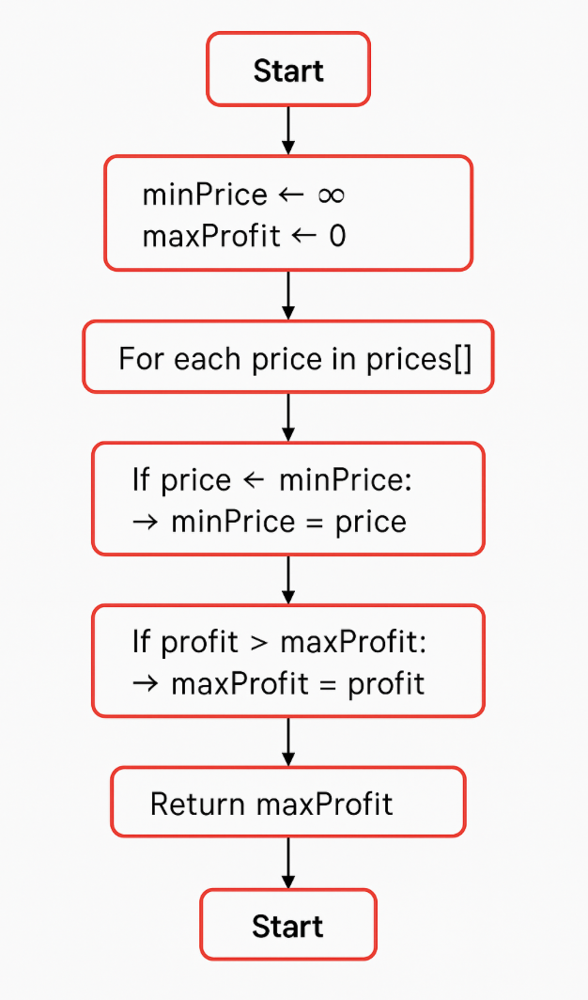

# Best Time to Buy and Sell Stock (Brute Force)

## Problem Statement

You are given an array `prices` where `prices[i]` is the price of a stock on the **i-th day**.

You want to **maximize your profit** by:
- Choosing one day to **buy**
- Choosing a different future day to **sell**

Return the **maximum profit**.

If no profit is possible, return **0**.

---

# Examples

## Example 1

**Input**

```
prices = [7, 1, 5, 3, 6, 4]
```

**Output**

```
5
```

**Explanation**

- Buy on day 2 → price = 1  
- Sell on day 5 → price = 6  
- Profit = 6 - 1 = 5  

---

## Example 2

**Input**

```
prices = [7,6,4,3,1]
```

**Output**

```
0
```

**Explanation**

No profitable transaction is possible.

---

# Constraints

```
1 <= prices.length <= 10^5
0 <= prices[i] <= 10^4
```

---

# Approach (Brute Force)

1. Initialize `maxProfit = 0`
2. Use two nested loops:
   - Outer loop → choose buying day `i`
   - Inner loop → choose selling day `j > i`
3. Calculate profit:
   ```
   prices[j] - prices[i]
   ```
4. Update `maxProfit` if a larger profit is found

---

# Time Complexity

```
O(n²)
```

- Two nested loops
- Total comparisons ≈ n(n-1)/2

---

# Space Complexity

```
O(1)
```

- No extra data structures used

---

# Dry Run

### Input

```
prices = [7, 1, 5, 3, 6, 4]
```

### Iteration Steps

```
i = 0 (7)
  j = 1 → 1 - 7 = -6 → maxProfit = 0
  j = 2 → 5 - 7 = -2 → maxProfit = 0
  j = 3 → 3 - 7 = -4 → maxProfit = 0
  j = 4 → 6 - 7 = -1 → maxProfit = 0
  j = 5 → 4 - 7 = -3 → maxProfit = 0

i = 1 (1)
  j = 2 → 5 - 1 = 4 → maxProfit = 4
  j = 3 → 3 - 1 = 2 → maxProfit = 4
  j = 4 → 6 - 1 = 5 → maxProfit = 5
  j = 5 → 4 - 1 = 3 → maxProfit = 5

i = 2 (5)
  j = 3 → 3 - 5 = -2 → maxProfit = 5
  j = 4 → 6 - 5 = 1 → maxProfit = 5
  j = 5 → 4 - 5 = -1 → maxProfit = 5
```

### Final Result

```
maxProfit = 5
```

### Output

```
5
```

---

# Visualisation



---

# Code Implementations

## JavaScript

```javascript
var maxProfit = function(prices) {

    let maxProfit = 0;

    for (let i = 0; i < prices.length; i++) {

        for (let j = i + 1; j < prices.length; j++) {

            if ((prices[j] - prices[i]) > maxProfit) {

                maxProfit = prices[j] - prices[i];

            }

        }

    }

    return maxProfit;
};
```

---

## Python

```python id="python-max-profit"
def maxProfit(prices):

    max_profit = 0

    for i in range(len(prices)):

        for j in range(i + 1, len(prices)):

            if prices[j] - prices[i] > max_profit:

                max_profit = prices[j] - prices[i]

    return max_profit
```

---

## Java

```java id="java-max-profit"
class Solution {

    public int maxProfit(int[] prices) {

        int maxProfit = 0;

        for(int i = 0; i < prices.length; i++) {

            for(int j = i + 1; j < prices.length; j++) {

                if(prices[j] - prices[i] > maxProfit) {

                    maxProfit = prices[j] - prices[i];

                }

            }

        }

        return maxProfit;
    }
}
```

---

## C++

```cpp id="cpp-max-profit"
class Solution {

public:

    int maxProfit(vector<int>& prices) {

        int maxProfit = 0;

        for(int i = 0; i < prices.size(); i++) {

            for(int j = i + 1; j < prices.size(); j++) {

                if(prices[j] - prices[i] > maxProfit) {

                    maxProfit = prices[j] - prices[i];

                }

            }

        }

        return maxProfit;
    }

};
```

---

## C

```c id="c-max-profit"
int maxProfit(int* prices, int pricesSize) {

    int maxProfit = 0;

    for(int i = 0; i < pricesSize; i++) {

        for(int j = i + 1; j < pricesSize; j++) {

            if(prices[j] - prices[i] > maxProfit) {

                maxProfit = prices[j] - prices[i];

            }

        }

    }

    return maxProfit;
}
```

---

## C#

```csharp id="cs-max-profit"
public class Solution {

    public int MaxProfit(int[] prices) {

        int maxProfit = 0;

        for(int i = 0; i < prices.Length; i++) {

            for(int j = i + 1; j < prices.Length; j++) {

                if(prices[j] - prices[i] > maxProfit) {

                    maxProfit = prices[j] - prices[i];

                }

            }

        }

        return maxProfit;
    }
}
```

---

# Summary

- Uses **Brute Force approach**
- Checks all possible buy-sell pairs
- Easy to understand but not efficient

```
Time Complexity: O(n²)
Space Complexity: O(1)
```