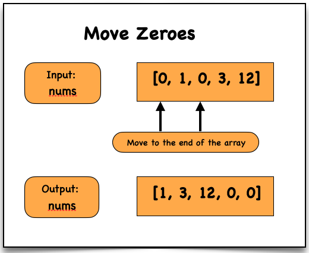

# Move Zeroes (In-place)

## Problem Statement

Given an integer array `nums`, move all **0’s to the end** while maintaining the **relative order of non-zero elements**.

> You must do this **in-place** without creating a copy of the array.

---

# Examples

## Example 1

**Input**

```
nums = [0,1,0,3,12]
```

**Output**

```
[1,3,12,0,0]
```

---

## Example 2

**Input**

```
nums = [0]
```

**Output**

```
[0]
```

---

# Constraints

```
1 <= nums.length <= 10^4
-2^31 <= nums[i] <= 2^31 - 1
```

---

# Approach (Optimal - Two Pointers)

## Steps

1. Initialize a pointer `x = 0`
2. Traverse the array:
   - If `nums[i] !== 0`
     - Assign `nums[x] = nums[i]`
     - Increment `x`
3. After traversal, fill remaining positions with `0`

---

# Time Complexity

```
O(n)
```

- One pass to move non-zero elements  
- One pass to fill zeros  

---

# Space Complexity

```
O(1)
```

- In-place modification  
- No extra memory used  

---

# Dry Run

### Input

```
nums = [0, 1, 0, 3, 12]
x = 0
```

### Iteration Steps

```
i = 0 → nums[0] = 0 → skip

i = 1 → nums[1] = 1 → nums[0] = 1 → x = 1

i = 2 → nums[2] = 0 → skip

i = 3 → nums[3] = 3 → nums[1] = 3 → x = 2

i = 4 → nums[4] = 12 → nums[2] = 12 → x = 3
```

### Fill Remaining with Zeros

```
nums[3] = 0
nums[4] = 0
```

### Output

```
[1, 3, 12, 0, 0]
```

---

# Visualisation



---

# Code Implementations

## JavaScript

```javascript
var moveZeroes = function(nums) {

    let x = 0;

    for (let i = 0; i < nums.length; i++) {

        if (nums[i] !== 0) {

            nums[x] = nums[i];
            x++;

        }

    }

    for (let i = x; i < nums.length; i++) {

        nums[i] = 0;

    }
};
```

---

## Python

```python id="python-move-zeroes"
def moveZeroes(nums):

    x = 0

    for i in range(len(nums)):

        if nums[i] != 0:

            nums[x] = nums[i]
            x += 1

    for i in range(x, len(nums)):

        nums[i] = 0
```

---

## Java

```java id="java-move-zeroes"
class Solution {

    public void moveZeroes(int[] nums) {

        int x = 0;

        for(int i = 0; i < nums.length; i++) {

            if(nums[i] != 0) {

                nums[x] = nums[i];
                x++;

            }

        }

        for(int i = x; i < nums.length; i++) {

            nums[i] = 0;

        }
    }
}
```

---

## C++

```cpp id="cpp-move-zeroes"
class Solution {

public:

    void moveZeroes(vector<int>& nums) {

        int x = 0;

        for(int i = 0; i < nums.size(); i++) {

            if(nums[i] != 0) {

                nums[x] = nums[i];
                x++;

            }

        }

        for(int i = x; i < nums.size(); i++) {

            nums[i] = 0;

        }
    }

};
```

---

## C

```c id="c-move-zeroes"
void moveZeroes(int* nums, int numsSize) {

    int x = 0;

    for(int i = 0; i < numsSize; i++) {

        if(nums[i] != 0) {

            nums[x] = nums[i];
            x++;

        }

    }

    for(int i = x; i < numsSize; i++) {

        nums[i] = 0;

    }
}
```

---

## C#

```csharp id="cs-move-zeroes"
public class Solution {

    public void MoveZeroes(int[] nums) {

        int x = 0;

        for(int i = 0; i < nums.Length; i++) {

            if(nums[i] != 0) {

                nums[x] = nums[i];
                x++;

            }

        }

        for(int i = x; i < nums.Length; i++) {

            nums[i] = 0;

        }
    }
}
```

---

# Summary

- Uses **Two Pointer Technique**
- Maintains **relative order**
- Works **in-place**

```
Time Complexity: O(n)
Space Complexity: O(1)
```