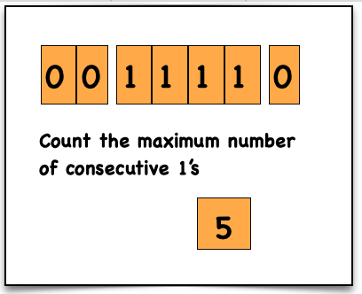

# Maximum Consecutive 1's

## Problem Statement

Given a binary array `nums`, return the **maximum number of consecutive 1’s** in the array.

---

# Examples

## Example 1

**Input**

```
nums = [1,1,0,1,1,1]
```

**Output**

```
3
```

**Explanation**

- First two 1s → count = 2  
- Last three 1s → count = 3  
- Maximum = **3**

---

## Example 2

**Input**

```
nums = [1,0,1,1,0,1]
```

**Output**

```
2
```

---

# Constraints

```
1 <= nums.length <= 10^5
nums[i] is either 0 or 1
```

---

# Approach (Optimal - Single Pass)

## Steps

1. Initialize two variables:
   - `currentCount` → tracks current streak of 1s
   - `maxCount` → stores maximum streak
2. Traverse the array:
   - If `nums[i] == 1` → increment `currentCount`
   - If `nums[i] == 0`:
     - Update `maxCount`
     - Reset `currentCount = 0`
3. After loop:
   - Return `max(maxCount, currentCount)`

---

# Time Complexity

```
O(n)
```

- Single traversal of array

---

# Space Complexity

```
O(1)
```

- Only two variables used

---

# Dry Run

### Input

```
nums = [1, 1, 0, 1, 1, 1]
```

### Steps

```
i = 0 → 1 → currentCount = 1
i = 1 → 1 → currentCount = 2

i = 2 → 0 → maxCount = 2, currentCount = 0

i = 3 → 1 → currentCount = 1
i = 4 → 1 → currentCount = 2
i = 5 → 1 → currentCount = 3
```

### Output

```
max(2, 3) = 3
```

---

# Visualisation



---

# Code Implementations

## JavaScript

```javascript
var findMaxConsecutiveOnes = function(nums) {

    let currentCount = 0;
    let maxCount = 0;

    for (let i = 0; i < nums.length; i++) {

        if (nums[i] == 1) {

            currentCount++;

        } else {

            maxCount = Math.max(currentCount, maxCount);
            currentCount = 0;

        }

    }

    return Math.max(maxCount, currentCount);
};
```

---

## Python

```python id="python-max-ones"
def findMaxConsecutiveOnes(nums):

    currentCount = 0
    maxCount = 0

    for num in nums:

        if num == 1:

            currentCount += 1

        else:

            maxCount = max(maxCount, currentCount)
            currentCount = 0

    return max(maxCount, currentCount)
```

---

## Java

```java id="java-max-ones"
class Solution {

    public int findMaxConsecutiveOnes(int[] nums) {

        int currentCount = 0;
        int maxCount = 0;

        for(int num : nums) {

            if(num == 1) {

                currentCount++;

            } else {

                maxCount = Math.max(maxCount, currentCount);
                currentCount = 0;

            }

        }

        return Math.max(maxCount, currentCount);
    }
}
```

---

## C++

```cpp id="cpp-max-ones"
class Solution {

public:

    int findMaxConsecutiveOnes(vector<int>& nums) {

        int currentCount = 0;
        int maxCount = 0;

        for(int num : nums) {

            if(num == 1) {

                currentCount++;

            } else {

                maxCount = max(maxCount, currentCount);
                currentCount = 0;

            }

        }

        return max(maxCount, currentCount);
    }

};
```

---

## C

```c id="c-max-ones"
int findMaxConsecutiveOnes(int* nums, int numsSize) {

    int currentCount = 0;
    int maxCount = 0;

    for(int i = 0; i < numsSize; i++) {

        if(nums[i] == 1) {

            currentCount++;

        } else {

            if(currentCount > maxCount)
                maxCount = currentCount;

            currentCount = 0;

        }

    }

    return currentCount > maxCount ? currentCount : maxCount;
}
```

---

## C#

```csharp id="cs-max-ones"
public class Solution {

    public int FindMaxConsecutiveOnes(int[] nums) {

        int currentCount = 0;
        int maxCount = 0;

        foreach(int num in nums) {

            if(num == 1) {

                currentCount++;

            } else {

                maxCount = Math.Max(maxCount, currentCount);
                currentCount = 0;

            }

        }

        return Math.Max(maxCount, currentCount);
    }
}
```

---

# Summary

- Uses **Single Pass Traversal**
- Tracks streak using counters
- Efficient and optimal

```
Time Complexity: O(n)
Space Complexity: O(1)
```