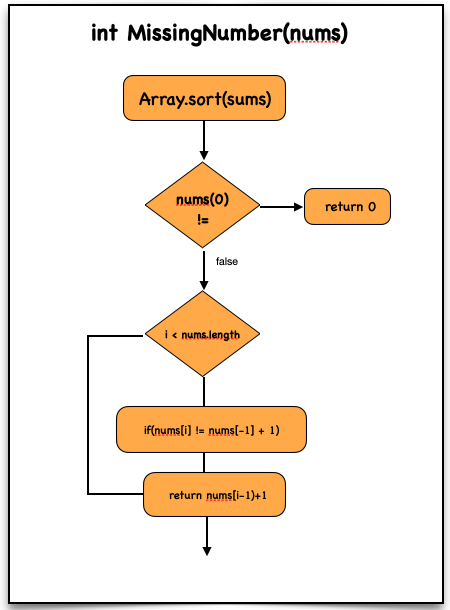

# Missing Number

## Problem Statement

Given an array `nums` containing **n distinct numbers** in the range `[0, n]`, return the **only number missing** from the array.

---

# Examples

## Example 1

**Input**

```
nums = [3,0,1]
```

**Output**

```
2
```

**Explanation**

Range = `[0,3]` → Missing number = **2**

---

## Example 2

**Input**

```
nums = [0,1]
```

**Output**

```
2
```

---

## Example 3

**Input**

```
nums = [9,6,4,2,3,5,7,0,1]
```

**Output**

```
8
```

---

# Constraints

```
n == nums.length
1 <= n <= 10^4
0 <= nums[i] <= n
All elements are unique
```

---

# Approach 1 (Brute Force - Sorting)

## Steps

1. Sort the array
2. Loop through elements:
   - If `nums[i] != nums[i-1] + 1` → return missing number
3. Edge cases:
   - If first element ≠ 0 → return 0
   - Else return `n`

---

## Time Complexity

```
O(n log n)
```

- Due to sorting

---

## Space Complexity

```
O(1)
```

- In-place sorting

---

## Dry Run

### Input

```
nums = [4, 2, 1, 0, 5]
```

### After Sorting

```
[0, 1, 2, 4, 5]
```

### Steps

```
i = 1 → 1 == 0 + 1
i = 2 → 2 == 1 + 1
i = 3 → 4 != 2 + 1 → missing = 3
```

### Output

```
3
```

---

## Code (JavaScript)

```javascript
var missingNumber = function(nums) {

    nums.sort((a, b) => a - b);

    if (nums[0] !== 0) return 0;

    for (let i = 1; i < nums.length; i++) {

        if (nums[i] !== nums[i - 1] + 1) {

            return nums[i - 1] + 1;

        }

    }

    return nums.length;
};
```

---

# Approach 2 (Optimal - Sum Formula)

## Idea

Sum of numbers from `0 to n`:

```
total_sum = (n × (n + 1)) / 2
```

Missing number:

```
missing = total_sum - actual_sum
```

---

## Steps

1. Calculate expected sum using formula
2. Calculate actual sum of array
3. Return difference

---

## Time Complexity

```
O(n)
```

---

## Space Complexity

```
O(1)
```

---

## Dry Run

### Input

```
nums = [3, 0, 1]
```

### Steps

```
n = 3

total_sum = (3 × 4) / 2 = 6

sum_of_array:
3 → 3
0 → 3
1 → 4

missing = 6 - 4 = 2
```

### Output

```
2
```

---

# Visualisation



---

# Code Implementations

## JavaScript

```javascript
var missingNumber = function(nums) {

    let n = nums.length;

    let total_sum = (n * (n + 1)) / 2;

    let sum_of_array = 0;

    for (let num of nums) {

        sum_of_array += num;

    }

    return total_sum - sum_of_array;
};
```

---

## Python

```python id="python-missing-number"
def missingNumber(nums):

    n = len(nums)

    total_sum = (n * (n + 1)) // 2

    sum_of_array = 0

    for num in nums:
        sum_of_array += num

    return total_sum - sum_of_array
```

---

## Java

```java id="java-missing-number"
class Solution {

    public int missingNumber(int[] nums) {

        int n = nums.length;

        int totalSum = (n * (n + 1)) / 2;

        int sum = 0;

        for(int num : nums) {
            sum += num;
        }

        return totalSum - sum;
    }
}
```

---

## C++

```cpp id="cpp-missing-number"
class Solution {

public:

    int missingNumber(vector<int>& nums) {

        int n = nums.size();

        int totalSum = (n * (n + 1)) / 2;

        int sum = 0;

        for(int num : nums) {
            sum += num;
        }

        return totalSum - sum;
    }

};
```

---

## C

```c id="c-missing-number"
int missingNumber(int* nums, int numsSize) {

    int n = numsSize;

    int totalSum = (n * (n + 1)) / 2;

    int sum = 0;

    for(int i = 0; i < numsSize; i++) {
        sum += nums[i];
    }

    return totalSum - sum;
}
```

---

## C#

```csharp id="cs-missing-number"
public class Solution {

    public int MissingNumber(int[] nums) {

        int n = nums.Length;

        int totalSum = (n * (n + 1)) / 2;

        int sum = 0;

        foreach(int num in nums) {
            sum += num;
        }

        return totalSum - sum;
    }
}
```

---

# Summary

- **Brute Force:** Sorting → O(n log n)
- **Optimal:** Math formula → O(n)

```
Time Complexity: O(n)
Space Complexity: O(1)
```

- Best approach for interviews: **Sum Formula**