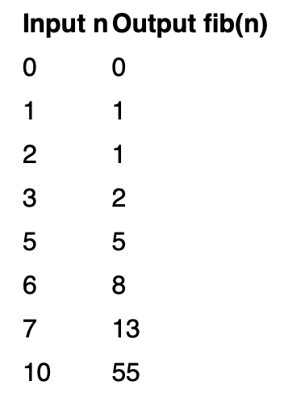

# Fibonacci Number (Recursion)

## What is a Fibonacci Number?

The **Fibonacci sequence** is a mathematical series in which each number is the **sum of the two preceding numbers**.

It is defined using the following recurrence relation:

```
F(0) = 0
F(1) = 1
F(n) = F(n-1) + F(n-2), for n > 1
```

This generates a sequence like:

```
0, 1, 1, 2, 3, 5, 8, 13, 21, 34...
```

Each number is formed by adding the previous two numbers.

---

# Real-world Applications

The Fibonacci sequence appears in:

- Flower petals 🌸
- Pine cones 🌲
- Spiral shells 🐚
- Dynamic Programming
- Recursive problems
- Optimization algorithms
- Computer Science concepts

---

# Approach (Recursion)

Recursion is a technique where a function solves a problem by calling itself on **smaller sub-problems**.

For Fibonacci:

To calculate:

```
fib(n)
```

We ask:

```
fib(n-1)
fib(n-2)
```

Then:

```
fib(n) = fib(n-1) + fib(n-2)
```

This process continues until reaching the **base cases**.

---

# Base Cases

```cpp
if(n == 0)
    return 0;

if(n == 1)
    return 1;
```

---

# Recursive Case

```cpp
return fib(n-1) + fib(n-2);
```

---

# Time Complexity

```
O(2^n)
```

### Why?

Each function call creates **two additional recursive calls**, creating a recursive tree.

Many subproblems repeat.

Example:

```
fib(5)
├── fib(4)
│   ├── fib(3)
│   └── fib(2)
└── fib(3)
```

Notice:

```
fib(3)
```

is computed multiple times.

---

# Space Complexity

```
O(n)
```

Reason:

Maximum recursive call stack depth = `n`

---

# Dry Run

### Input

```
n = 5
```

### Function Calls

```
fib(5)

= fib(4) + fib(3)

= (fib(3)+fib(2))
+ (fib(2)+fib(1))

= ((fib(2)+fib(1))+fib(2))
+ (fib(2)+1)

= 5
```

---

### Output

```
5
```

Generated sequence:

```
0,1,1,2,3,5
```

---

# Visualisation



---

# Sample Outputs

| Input | Output |
|---------|---------|
| 0 | 0 |
| 1 | 1 |
| 2 | 1 |
| 3 | 2 |
| 5 | 5 |
| 8 | 21 |

---

# Code Implementations

## JavaScript

```javascript
function fib(n) {

    if (n <= 1)
        return n;

    return fib(n - 1) + fib(n - 2);
}

console.log(fib(5)); // 5
```

---

## Python

```python id="python-fibonacci"
def fib(n):

    if n <= 1:
        return n

    return fib(n - 1) + fib(n - 2)


print(fib(5))  # 5
```

---

## Java

```java id="java-fibonacci"
class Solution {

    public int fib(int n) {

        if(n <= 1)
            return n;

        return fib(n - 1) + fib(n - 2);
    }
}
```

---

## C++

```cpp id="cpp-fibonacci"
class Solution {
public:

    int fib(int n) {

        if (n <= 1)
            return n;

        return fib(n - 1) + fib(n - 2);
    }
};
```

---

## C

```c id="c-fibonacci"
#include <stdio.h>

int fib(int n) {

    if(n <= 1)
        return n;

    return fib(n - 1) + fib(n - 2);
}

int main() {

    printf("%d", fib(5));

    return 0;
}
```

---

## C#

```csharp id="cs-fibonacci"
public class Solution {

    public int Fib(int n) {

        if(n <= 1)
            return n;

        return Fib(n - 1) + Fib(n - 2);
    }
}
```

---

# Summary

- Uses **Recursion**
- Solves smaller sub-problems repeatedly
- Has overlapping subproblems
- Not efficient for large values of `n`

```
Time Complexity: O(2^n)
Space Complexity: O(n)
```

### Note

For large inputs, use:

- Dynamic Programming
- Memoization
- Bottom-up DP

to optimize repeated calculations.